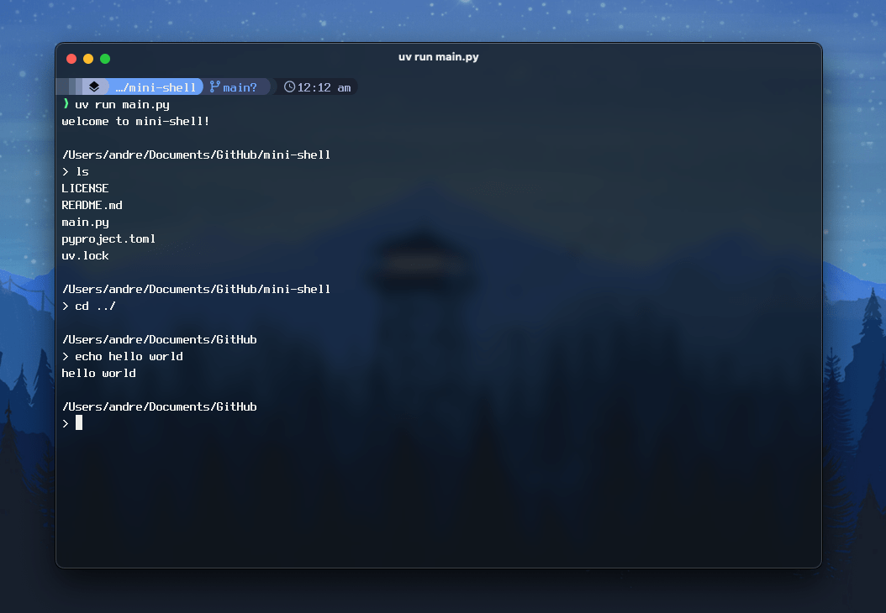

# 🤏 mini-shell

A minimal shell made in Python.



## Features

- Shell built-ins:

  - Change directory command (`cd`)
  - Exit command (`exit`)

- Support for other system/application commands

## Usage

```zsh
uv sync
uv run main.py
```

## 🧾 License

[MIT](LICENSE)
